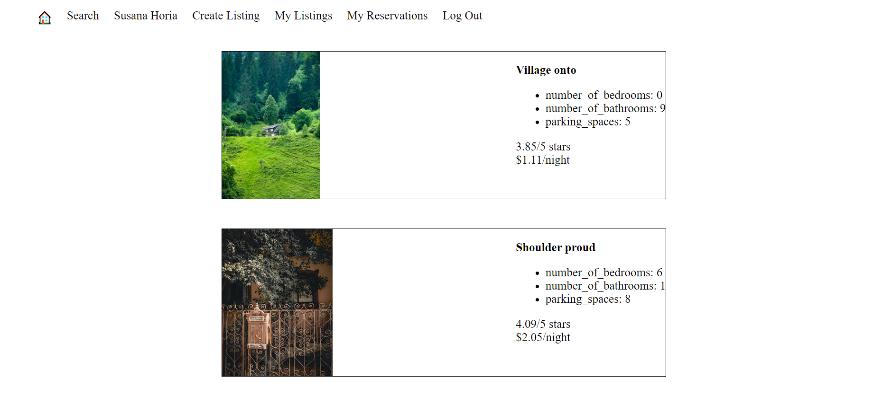

# LightBnB

A simple multi-page Airbnb clone that uses a server-side JavaScript to display the information from queries to web pages via SQL queries.

- log in or sign up
- create new listings
- view user's reservations
- search and filter the properties db by:
  - city
  - min\max cost
  - minimum rating



## Project Structure

```
.
├── db
│   ├── json
│   └── database.js
├── public
│   ├── javascript
│   │   ├── components 
│   │   │   ├── header.js
│   │   │   ├── login_form.js
│   │   │   ├── new_property_form.js
│   │   │   ├── property_listing.js
│   │   │   ├── property_listings.js
│   │   │   ├── search_form.js
│   │   │   └── signup_form.js
│   │   ├── libraries
│   │   ├── index.js
│   │   ├── network.js
│   │   └── views_manager.js
│   ├── styles
│   │   ├── main.css
│   │   └── main.css.map
│   └── index.html
├── routes
│   ├── apiRoutes.js
│   └── userRoutes.js
├── styles  
│   ├── _forms.scss
│   ├── _header.scss
│   ├── _property-listings.scss
│   └── main.scss
├── .gitignore
├── package-lock.json
├── package.json
├── README.md
└── server.js
```

* `db` contains all the database interaction code.
  * `json` is a directory that contains a bunch of dummy data in `.json` files.
  * `database.js` is responsible for all queries to the database. It doesn't currently connect to any database, all it does is return data from `.json` files.
* `public` contains all of the HTML, CSS, and client side JavaScript. 
  * `index.html` is the entry point to the application. It's the only html page because this is a single page application.
  * `javascript` contains all of the client side javascript files.
    * `index.js` starts up the application by rendering the listings.
    * `network.js` manages all ajax requests to the server.
    * `views_manager.js` manages which components appear on screen.
    * `components` contains all of the individual html components. They are all created using jQuery.
* `routes` contains the router files which are responsible for any HTTP requests to `/users/something` or `/api/something`. 
* `styles` contains all of the sass files. 
* `server.js` is the entry point to the application. This connects the routes to the database.

## Getting started

Open a terminal and start postgres by running: 

`startpostgres`

Then navigate to "LightBnB_WebApp-master" directory inside the root directory and run.

`npm run local`

You should be able to view the app in your browser going to localhost:3000.


## Dependencies 

- bcrypt, 
- cookie-session
- express
- nodemon
- pg

## Dev dependencies

- eslint
